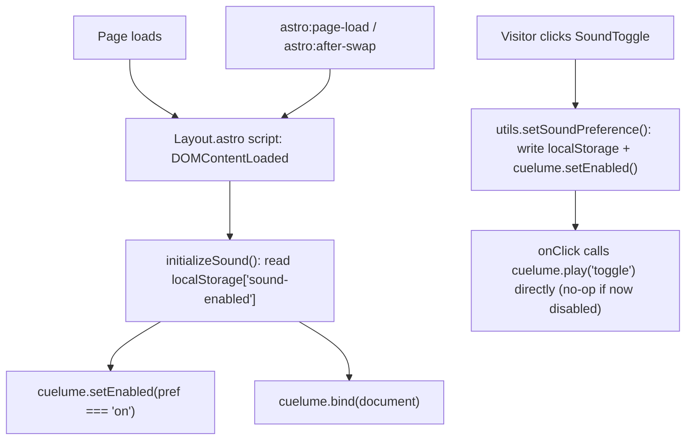

# Add curated interaction sounds via Cuelume

## Summary

Add the `cuelume` npm library (v0.1.0, MIT, zero deps, Web-Audio-synthesized, no audio files) to give lukemcdonald.com a small set of tasteful, curated interaction sounds — the command palette, nav dropdowns, theme pickers, and primary CTAs — controlled by a single persisted on/off preference that mirrors the existing `theme-mode`/`theme-color` system.

## Problem Frame

The site recently gained a real interaction layer: a ⌘K command palette (`src/components/CommandPalette/`) and a personalization system for theme mode and accent color (`src/components/ThemeMode/`, `src/components/ThemeColor/`), all built on this branch. These moments are currently silent. Cuelume offers ten hand-tuned, synthesized sound recipes and a tiny declarative API (`data-cuelume-*` attributes plus `bind()`/`play()`/`setEnabled()`) that can layer sound onto exactly the interactions worth noticing, without shipping audio files or a heavy dependency. The goal is not "add sound effects" broadly — it's to give the site's signature interactions (opening the palette, switching themes, navigating) a distinct sonic identity, while staying silent by default and easy to fully disable.

This plan targets the `theme-mode` branch (not `main`), since `main` does not yet contain the CommandPalette, ThemeMode, or ThemeColor components this plan builds on top of — confirmed with the user, who wants the sound work planned as a continuation of the in-flight personalization branch rather than re-derived against `main`.

---

## Requirements

- R1. Visitors can enable or disable interaction sounds via a toggle inside the ⌘K command palette, next to the existing `ThemeModePicker`/`ThemeColorPicker`.
- R2. Sound defaults to **off** for first-time visitors; the chosen preference persists across page loads and Astro client-side navigations via `localStorage`.
- R3. When enabled, a curated set of interactions plays a distinct Cuelume cue: ⌘K palette open/close, palette result hover/select, nav dropdown open/close and item hover/select, theme mode/color selection, and designated primary CTAs (resume link, contact/social links) — see Sound-to-Interaction Mapping below.
- R4. When disabled, no interaction produces sound, and no console errors or SSR failures occur.
- R5. The sound preference and its bindings behave identically after a full page load and after an Astro view-transition navigation.
- R6. The implementation introduces no runtime dependency beyond `cuelume` itself and adds no audio files to the repo.

---

## Key Technical Decisions

- **Sound defaults to off, independent of `prefers-reduced-motion`:** Cuelume exposes no reduced-motion check itself, and the user confirmed off-by-default as the safer choice for first-time visitors. Once a visitor explicitly opts in via the toggle, their choice is honored without further gating — `prefers-reduced-motion` is a visual-motion signal, not an audio one, so it does not override an explicit opt-in.
- **Preference stored as `'on' | 'off'` under `localStorage['sound-enabled']`:** mirrors the string-enum convention `theme-mode`/`theme-color` already use, rather than introducing a raw boolean, so the new module reads the same way as its siblings.
- **`bind()` is called once against `document`, re-invoked on the same view-transition hooks the theme system already uses:** confirmed directly against Cuelume's compiled source (`dist/interactions/bind.js`) that `bind()` guards re-entry with a `WeakSet` of already-bound roots, so a second call on the same root is a genuine no-op, not merely documented as one. Re-invocation on `astro:before-preparation`/`astro:after-swap`/`astro:page-load` isn't strictly required for correctness given that guard, but mirroring `initializeTheme()`'s wiring keeps the two systems symmetric and protects against future Astro internals changes.
- **A build-time master flag, `SOUND_CONFIG.enableSounds`, lives in a new `src/configs/sound.ts`:** parallel to `THEME_CONFIG`, letting the whole feature be switched off independent of any visitor's stored preference.
- **Sound coverage is hand-curated per component, not blanket-bound:** every element that gets a `data-cuelume-*` attribute is an explicit, reviewed choice (see mapping below) rather than a global sweep across every link and button.
- **`press`, `release`, and `hover` cues are mouse-pointer-only by Cuelume's own design; `toggle` is not.** Confirmed against `dist/interactions/bind.js`: the `pointerdown`/`pointerup`/`pointerenter` listeners backing `data-cuelume-press`/`-release`/`-hover` all gate on `pointerType === 'mouse'` plus a `(hover: hover) and (pointer: fine)` media query, so keyboard activation and touch taps never trigger them, while the `click` listener backing `data-cuelume-toggle` carries no such gate and fires identically for mouse, touch, and keyboard activation. This plan accepts that scoping rather than working around it: underlying functionality (navigation, selection, state changes) is unaffected on keyboard/touch, only the press/release/hover sound layer is mouse-only, matching Cuelume's own accessibility posture (see Scope Boundaries).
- **The `SoundToggle`'s own click is handled imperatively, not via `data-cuelume-toggle`.** Cuelume's `data-cuelume-toggle` listener is registered on `document` with `useCapture: true`, so it always fires during the capture phase, strictly before the event reaches the target and before React's bubble-phase `onClick` ever runs. No ordering trick inside a React click handler can make `setEnabled(true)` run before that capture listener evaluates state, so relying on the attribute for this one element would make the very click that enables sound permanently silent. Instead, `SoundToggle`'s `onClick` calls `setSoundPreference(next)` (which calls `cuelume.setEnabled()`) and then calls `cuelume.play('toggle')` directly in the same handler — `play()` is itself a no-op when `enabled` is `false`, so this sequencing is correct on both the enabling and disabling click without depending on listener-phase ordering at all.

---

## Sound-to-Interaction Mapping

Ten fixed cues exist. Seven — `chime`, `whisper`, `tick`, `press`, `release`, `toggle`, `droplet` — are assigned deliberately below. The remaining three (`sparkle`, `bloom`, `success`) are reserved for future use (see Scope Boundaries) rather than forced into a v1 slot — `success` specifically has no bound feature today (see U7).

Recall the mouse-pointer scoping noted under Key Technical Decisions: `press`, `release`, and `hover` triggers only fire for `pointerType === 'mouse'` on a fine-pointer device; `toggle` (click-based) fires for mouse, touch, and keyboard alike. The "Trigger" column below reflects that as given, not as a gap to close.

| Interaction | Cue(s) | Trigger |
| --- | --- | --- |
| ⌘K palette opens | `chime` | Imperative `play('chime')` in the effect reacting to the dialog's open transition (no single DOM element to bind — opened via keyboard) |
| ⌘K palette closes (Esc / backdrop / selection) | `whisper` | Imperative `play('whisper')` in the close transition |
| Palette result hover (mouse only) | `tick` | `data-cuelume-hover="tick"` on each result row |
| Palette result press (select/navigate, mouse only) | `press` + `release` | `data-cuelume-press` + `data-cuelume-release` on each result row |
| Nav dropdown open/close (all inputs) | `toggle` | `data-cuelume-toggle` on the `MenuButton` |
| Nav item hover (mouse only) | `tick` | `data-cuelume-hover="tick"` on each `MenuItem` |
| Nav item press (navigate, mouse only) | `press` + `release` | `data-cuelume-press` + `data-cuelume-release` |
| Theme mode / color selection (mouse only) | `press` + `release` | `data-cuelume-press` + `data-cuelume-release` on each button/swatch (a decisive discrete selection, distinct from a binary toggle) |
| Theme color swatch hover (mouse only) | `droplet` | `data-cuelume-hover="droplet"` (paint metaphor) |
| Sound toggle itself (all inputs) | `toggle` | Imperative `setSoundPreference()` + `play('toggle')` in the `onClick` handler — not the `data-cuelume-toggle` attribute (see Key Technical Decisions) |
| Primary CTA hover (resume link, contact/social links; mouse only) | `tick` | `data-cuelume-hover="tick"` |
| Primary CTA press (mouse only) | `press` + `release` | `data-cuelume-press` + `data-cuelume-release` |

---

## High-Level Technical Design



The bootstrap path (top) is identical in shape to the existing `initializeTheme()` lifecycle. The preference-change path (bottom-left) is the only place state is written; it calls `play('toggle')` imperatively rather than relying on Cuelume's own `data-cuelume-toggle` listener, since that listener runs in the capture phase and would otherwise evaluate the `enabled` state before this handler's `setEnabled()` call could take effect (KTD6).

---

## Output Structure

```
src/
  components/
    Sound/
      Sound.tsx      # SoundToggle component
      constants.ts   # storage key, default preference
      types.ts        # SoundPreference type
      utils.ts        # getSoundPreference / setSoundPreference / initializeSound
      index.ts        # barrel export
  configs/
    sound.ts          # SOUND_CONFIG feature flag
```

---

## Scope Boundaries

### Deferred to Follow-Up Work

- Volume control — Cuelume's API exposes only `setEnabled(boolean)`, no gain/volume control.
- Custom sound registration or new recipes beyond the ten built-ins.
- `sparkle` and `bloom` — reserved for a future easter egg or section-expand interaction; not wired in this plan.
- The `success` cue and a contact copy-to-clipboard feature — no copy-to-clipboard interaction exists in `ContactInfo.astro` (or anywhere else in the codebase) today; building one is a separate, undiscussed feature and is not pulled into this plan just to give `success` a home.
- Extending `press`/`release`/`hover` cues to keyboard-focus states — Cuelume itself scopes those triggers to fine-pointer mouse input (see Key Technical Decisions); this plan does not add a parallel focus-triggered path to reach input-modality parity. Keyboard and touch users still get full `toggle`-cue coverage and completely unaffected underlying functionality, just without the mouse-only sound layer.
- Multi-tab preference sync via a `storage` event listener.
- Extending sound to inline prose links (blog posts, resume body content) — CTA coverage in this plan is limited to designated top-level elements (resume link, `ContactInfo.astro`'s contact/social links), not every link on the site.
- A second, always-visible sound toggle outside ⌘K — confirmed with the user that ⌘K remains the single settings surface for this feature, consistent with the existing theme pickers. This is a deliberate, accepted trade-off against discoverability, not an oversight: most visitors will never open ⌘K, and this plan does not add a first-visit affordance to advertise the feature.
- Building an in-house Web Audio wrapper instead of adopting Cuelume — rejected because Cuelume's value is its ten hand-tuned recipes and zero-dependency footprint; replicating that sound-design quality in-house would cost more than the version-pinning risk (see Risks & Dependencies) it avoids.

---

## Implementation Units

### U1. Add Cuelume dependency and Sound config scaffolding

- **Goal:** Introduce the `cuelume` package and a build-time feature flag mirroring `THEME_CONFIG`.
- **Requirements:** R6
- **Dependencies:** none
- **Files:** `package.json`, `pnpm-lock.yaml`, `src/configs/sound.ts` (new)
- **Approach:** `pnpm add cuelume`, pinned to the exact published version rather than a caret range (see Risks). Create a `SOUND_CONFIG` object (`enableSounds: boolean`) analogous to `THEME_CONFIG` in `src/configs/theme.ts`.
- **Patterns to follow:** `src/configs/theme.ts` shape and export style.
- **Test scenarios:** Test expectation: none -- pure dependency and config addition with no behavior to exercise yet.
- **Verification:** `pnpm install` completes cleanly; `SOUND_CONFIG` is importable with the expected default.

### U2. Sound preference module

- **Goal:** Build the `localStorage`-backed preference module, mirroring `ThemeMode`'s constants/types/utils split, exposing `getSoundPreference`, `setSoundPreference`, and `initializeSound`.
- **Requirements:** R1, R2, R4, R5
- **Dependencies:** U1
- **Files:** `src/components/Sound/constants.ts`, `src/components/Sound/types.ts`, `src/components/Sound/utils.ts`, `src/components/Sound/index.ts` (all new)
- **Approach:** `types.ts` defines `SoundPreference = 'on' | 'off'`. `constants.ts` defines `SOUND_STORAGE_KEY = 'sound-enabled'` and `DEFAULT_SOUND_PREFERENCE: SoundPreference = 'off'`. `utils.ts` implements read/write against `localStorage` plus a bootstrap function that applies the stored preference to Cuelume and binds delegated listeners.
- **Patterns to follow:** `src/components/ThemeMode/utils.ts` (`getThemeMode`/`setThemeMode` shape), `src/utils/theme.ts` (`initializeTheme` pattern).
- **Technical design (directional):**
  ```
  initializeSound():
    if not SOUND_CONFIG.enableSounds: return
    pref = getSoundPreference()          // localStorage or DEFAULT_SOUND_PREFERENCE
    cuelume.setEnabled(pref === 'on')
    cuelume.bind(document)
  ```
- **Test scenarios:**
  - Happy path: `getSoundPreference()` returns `'off'` when `localStorage` is empty (first visit).
  - Happy path: `setSoundPreference('on')` persists `'on'` to `localStorage` and calls `cuelume.setEnabled(true)`.
  - Edge case: `getSoundPreference()` falls back to the default when `localStorage` holds an unrecognized value.
  - Integration: `initializeSound()` never calls `bind`/`setEnabled` when `SOUND_CONFIG.enableSounds` is `false`.
- **Verification:** Exercise `getSoundPreference`/`setSoundPreference`/`initializeSound` against a stubbed `localStorage`, confirming persisted state and the correct Cuelume calls in each case.

### U3. SoundToggle component wired into CommandPalette

- **Goal:** A `SoundToggle` button matching `ThemeModePicker`'s visual and interaction style, placed in `CommandPalette` next to `ThemeModePicker`/`ThemeColorPicker`.
- **Requirements:** R1
- **Dependencies:** U2, U4 (relies on Cuelume already being bound and configured by the global bootstrap)
- **Files:** `src/components/Sound/Sound.tsx` (new), `src/components/CommandPalette/CommandPalette.tsx` (modify)
- **Approach:** A React component that reads the current preference on mount, updates its own icon accordingly (e.g. a speaker/muted-speaker icon pair, following the existing icon-button conventions), and exposes its state to assistive tech via `aria-pressed` (or `role="switch"` + `aria-checked`) rather than the icon swap alone. Per KTD6, the `onClick` handler does **not** use `data-cuelume-toggle` — it calls `setSoundPreference(next)` and then `cuelume.play('toggle')` directly in sequence, since `play()` is a no-op whenever `enabled` is `false`.
- **Patterns to follow:** `src/components/ThemeMode/ThemeMode.tsx` button and icon structure.
- **Test scenarios:**
  - Happy path: clicking the toggle when off flips it to on, persists `'on'`, updates the icon, and plays an audible `toggle` cue.
  - Happy path: clicking again flips back to off, updates the icon, and plays no cue (since `setEnabled(false)` runs before `play('toggle')` in the same handler).
  - Edge case: the component reflects the currently stored preference on initial render, with no flash of the wrong icon.
  - Integration (covers KTD6): confirms the imperative `setSoundPreference` → `play('toggle')` sequence, not the `data-cuelume-toggle` attribute, drives the cue — verifying the fix actually sidesteps the capture-phase ordering problem rather than relying on manual observation alone.
- **Verification:** Manual dev-server check — open ⌘K, toggle sound, confirm the icon change, the audible cue, and the persisted `localStorage` value after reload.

### U4. Global sound bootstrap in Layout.astro

- **Goal:** Wire `initializeSound()` into the site's existing client bootstrap alongside `initializeTheme()`, including the view-transition re-init hooks.
- **Requirements:** R2, R5
- **Dependencies:** U2
- **Files:** `src/layouts/Layout.astro` (modify)
- **Approach:** Call `initializeSound()` on `DOMContentLoaded` and on `astro:page-load`, mirroring where `initializeTheme()`/`watchSystemPreference()` are already invoked. No `is:inline` pre-CSS treatment is needed — sound has no FOUC-equivalent concern.
- **Patterns to follow:** The existing theme init and view-transition wiring already in `src/layouts/Layout.astro`.
- **Test scenarios:**
  - Happy path: after a full page load, the stored preference is correctly applied to Cuelume.
  - Integration (covers R5): after an Astro client-side navigation, the preference is still correctly applied without a full reload.
  - Edge case: with `SOUND_CONFIG.enableSounds` set to `false`, no Cuelume calls occur anywhere in the bootstrap.
- **Verification:** Dev-server click-through navigating between internal pages, confirming sound state survives each navigation; `astro build` produces no SSR errors from the new script.

### U5. Instrument CommandPalette interactions

- **Goal:** Apply the mapping's cues to the palette's open/close transitions and result rows.
- **Requirements:** R3
- **Dependencies:** U4
- **Files:** `src/components/CommandPalette/CommandPalette.tsx` (modify)
- **Approach:** `play('chime')` in the effect reacting to the dialog opening; `play('whisper')` on close (Escape, backdrop click, or selection); `data-cuelume-hover="tick"` plus `data-cuelume-press`/`data-cuelume-release` on each rendered result row.
- **Patterns to follow:** The existing open-state `useEffect`/`useState` handling already in `CommandPalette.tsx`.
- **Test scenarios:**
  - Happy path: opening the palette via ⌘K plays `chime` exactly once per open.
  - Happy path: closing via Escape plays `whisper` exactly once per close.
  - Edge case: rapidly toggling ⌘K open and closed does not queue or overlap duplicate cues — each transition plays its own cue once.
  - Integration: `CommandPalette` has no arrow-key highlight/roving-focus state today — results are plain `<a>` elements reached by `Tab`. Confirm that Tab-focusing a result then pressing `Enter` still navigates correctly and, per the mouse-only scoping in Key Technical Decisions, correctly produces no `press`/`release` cue on that keyboard path (expected, not a bug) while a mouse click on the same row does produce both.
- **Verification:** Manual dev-server pass with sound on: opening/closing the palette (mouse and keyboard), hovering and clicking results with a mouse (expect `tick`/`press`/`release`), and Tab+Enter through results (expect navigation with no `press`/`release` cue).

### U6. Instrument NavMenu interactions

- **Goal:** Apply cues to nav dropdown open/close and item hover/press.
- **Requirements:** R3
- **Dependencies:** U4
- **Files:** `src/components/Nav/NavMenu.tsx` (modify)
- **Approach:** `data-cuelume-toggle` on the `MenuButton`; `data-cuelume-hover="tick"` plus `data-cuelume-press`/`data-cuelume-release` on each `MenuItem`.
- **Patterns to follow:** The existing Headless UI `Menu`/`MenuButton`/`MenuItems` structure in `NavMenu.tsx`.
- **Test scenarios:**
  - Happy path: opening a nav dropdown plays `toggle`; closing it (re-click or outside click) plays `toggle` again.
  - Happy path: with a mouse, hovering a menu item plays `tick`; clicking plays `press` then `release`.
  - Edge case: on a touch/coarse-pointer device, both hover (`tick`) and press/release cues are suppressed (Cuelume gates all three to `pointerType === 'mouse'` on a fine-pointer device), while tapping the `MenuButton` itself still plays `toggle` and the menu still opens/closes and items still navigate correctly.
- **Verification:** Manual dev-server pass across the nav dropdowns with a mouse, plus a touch-emulated check (e.g. browser devtools device toolbar) confirming hover/press/release are silent on touch while `toggle` and underlying navigation still work.

### U7. Instrument theme pickers and primary CTAs

- **Goal:** Apply cues to `ThemeModePicker`, `ThemeColorPicker`, and the designated top-level CTA elements (resume link, `ContactInfo.astro`'s contact/social links).
- **Requirements:** R3
- **Dependencies:** U4
- **Files:** `src/components/ThemeMode/ThemeMode.tsx`, `src/components/ThemeColor/ThemeColor.tsx`, `src/components/ContactInfo.astro`, and the resume-link component — confirm the exact resume-link file during implementation (modify)
- **Approach:** `data-cuelume-press`/`data-cuelume-release` on mode buttons and color swatches; `data-cuelume-hover="droplet"` on color swatches specifically; `data-cuelume-hover="tick"` plus press/release on the designated CTA elements only, not blanket-applied to every link on the site. `ContactInfo.astro` renders plain text `Link` elements (Email, GitHub, LinkedIn), not icons — instrument those links directly, not an icon glyph. No `success` cue is wired here (see Scope Boundaries — no copy-to-clipboard feature exists to bind it to).
- **Patterns to follow:** U5/U6's attribute usage, for consistency across the site.
- **Test scenarios:**
  - Happy path: with a mouse, selecting a theme mode or color plays `press` then `release`.
  - Happy path: with a mouse, hovering a color swatch plays `droplet`.
  - Happy path: with a mouse, hovering or pressing the resume link or a `ContactInfo.astro` link plays `tick` on hover and `press`/`release` on click.
  - Edge case: on touch or via keyboard activation, the same interactions still navigate/select correctly with no `press`/`release`/`droplet`/`tick` cue (mouse-only scoping from Key Technical Decisions).
- **Verification:** Manual dev-server pass through ⌘K's theme pickers and the site's designated CTA elements with sound on, confirming each expected cue, and confirming no cue fires on out-of-scope links (e.g. inline resume or blog prose links).

---

## Risks & Dependencies

- **Branch dependency and drift:** This plan assumes the `theme-mode` branch (CommandPalette, ThemeMode, ThemeColor) lands on `main` before or alongside this work — the `SoundToggle`'s only planned home is inside ⌘K next to the existing theme pickers, which do not exist on `main` today. That branch is also still under active structural refactoring at the time of writing (e.g. the most recent commit is `refactor: create components`), so the exact file structure this plan's "Patterns to follow" references cite (`ThemeMode.tsx`, `CommandPalette.tsx`, `NavMenu.tsx`) is a snapshot, not a fixed contract — re-verify those files' current shape at the start of implementation rather than assuming they're unchanged.
- **Pre-1.0 API risk:** Cuelume is v0.1.0, published as a single version from a single maintainer; its intentionally small public surface (no volume, no custom sounds) could change before a 1.0 release. Mitigation: pin the exact version in `package.json` rather than a caret range, and revisit on any future upgrade.
- **AudioContext gesture requirement:** Most browsers require a user gesture to start or resume a Web Audio `AudioContext`. Cuelume's `play()` already resumes a suspended context internally, and every cue in this plan is triggered from a real pointer/keyboard interaction handler, so no additional handling is needed.
- **Hover-cue stutter on rapid sweeps:** confirmed against `dist/interactions/bind.js` that Cuelume throttles `pointerenter`-triggered hover cues internally (a ~150ms gap between plays), so quickly sweeping a mouse across several palette results or nav items will not produce overlapping or stuttering `tick` sounds — no additional app-level throttling is needed.
- **Low discoverability is accepted, not a defect:** off-by-default sound with the only control inside ⌘K means most visitors will never encounter this feature at all. That trade-off was surfaced and confirmed with the user during scoping (see Scope Boundaries) rather than discovered late; it is called out here so it isn't mistaken for an oversight during review.

---

## Sources & Research

- Cuelume's API was confirmed directly from the published package's **compiled source**, not just its type declarations or marketing copy: `unpkg.com/cuelume/dist/*.d.ts` gave the public function signatures (`bind`, `play`, `setEnabled`, the `SoundName` union), and `unpkg.com/cuelume/dist/interactions/bind.js` / `dist/audio/engine.js` were read directly to verify the `useCapture: true` registration behind `data-cuelume-toggle` (the basis for the KTD6 fix), the `pointerType === 'mouse'` gating behind `press`/`release`/`hover`, the `WeakSet`-based idempotency guard in `bind()`, the internal 150ms hover throttle, and the `enabled`/`play()` interaction that makes `play('toggle')` safely a no-op when disabled.
- `src/components/ThemeMode/` and `src/components/ThemeColor/` (each with `Component.tsx`, `constants.ts`, `types.ts`, `utils.ts`, `index.ts`) are the structural precedent this plan mirrors for `src/components/Sound/`.
- `src/utils/theme.ts` (`applyThemeMode`, `getThemeInitScript`, `initializeTheme`) and `src/layouts/Layout.astro`'s `DOMContentLoaded`/`astro:page-load` wiring are the global bootstrap pattern this plan extends for sound.
- `src/configs/theme.ts` (`THEME_CONFIG`) is the precedent for the new `SOUND_CONFIG` feature flag in `src/configs/sound.ts`.
